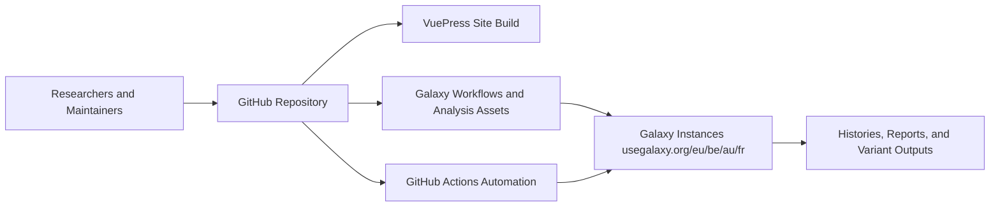
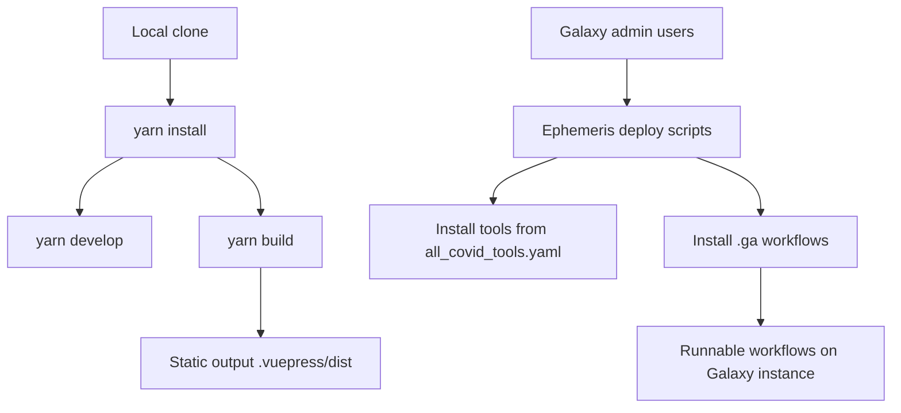

# Architecture

## 1) System overview

This repository combines documentation publishing and scientific workflow assets.



## 2) Major architectural layers

- **Presentation layer**: Markdown-based pages rendered by VuePress (`.vuepress/config.js` and theme files).
- **Workflow layer**: Galaxy workflow definitions (`.ga`) under `genomics/deploy/workflows/` and `cheminformatics/deploy/workflows/`.
- **Automation layer**: Scheduled GitHub Action and helper scripts in `genomics/4-Variation/`.
- **Data artifact layer**: Metadata TSVs, VCF archives, FASTA files, notebooks, and images.

## 3) Repository topology

```text
SARS-CoV-2/
├── .github/workflows/                # Scheduled automation
├── .vuepress/                        # VuePress config/theme/components
├── genomics/                         # Largest analysis area + automation scripts
│   ├── deploy/workflows/             # 11+ genomics .ga files
│   └── 4-Variation/                  # update scripts + large result artifacts
├── cheminformatics/
│   └── deploy/workflows/             # 7 cheminformatics .ga files
├── proteomics/                       # multiple project-specific readmes
├── direct-rnaseq/
├── artic/
├── evolution/
├── data/ and data-availability/
└── lit/
```

## 4) Content-to-navigation model

VuePress navigation is configured in `.vuepress/config.js` and routes users by scientific domain:

- Genomics
- Cheminformatics
- Evolution
- Direct RNAseq
- Proteomics
- Artic
- Data

This means most user-facing documentation is domain-centric, while operational code is concentrated in:

- `.github/workflows/fetch_accessions.yaml`
- `genomics/4-Variation/covid_genome.py`
- `genomics/4-Variation/fetch_sra_acc.sh`
- `genomics/4-Variation/fetch_genome_accessions.py`

## 5) Deployment model



## 6) Notable architectural characteristics

- This repo is intentionally **polyglot in artifact types** (Markdown, YAML, `.ga`, notebooks, TSV/VCF/FASTA data files).
- It is **documentation-first** but not documentation-only: operational workflow orchestration exists and is active.
- Genomics variation subdirectory acts as a **data operations hub** with scheduled updates and pipeline triggering.
- The same scientific analysis is represented as:
  - conceptual documentation pages
  - reusable Galaxy workflows
  - linked Galaxy histories for reproducibility

## 7) Inventory snapshot

From current repository scan:

- ~47 Markdown files
- 18 Galaxy workflow files (`.ga`)
- 2 Python scripts
- 10 Jupyter notebooks
- 2 YAML/YML files
- very large file count in `genomics/` due to generated data artifacts (metadata and VCF collections)
