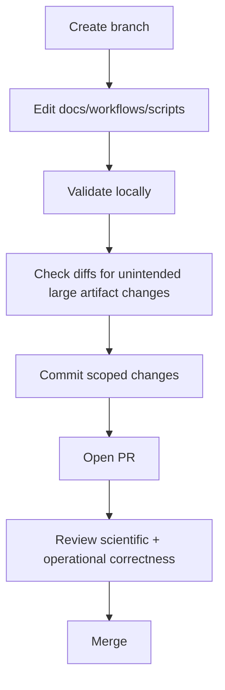

# Maintenance Guide

## 1) Local development

### Prerequisites

- Node/Yarn environment for VuePress
- optionally Conda-based Yarn env (as noted in `CONTRIBUTING.md`)

### Commands

```bash
yarn install
yarn develop
yarn build
```

- `yarn develop` serves the site locally (default `0.0.0.0:8080`)
- `yarn build` writes static output to `.vuepress/dist/`

## 2) Deploying workflows to a Galaxy instance

Both genomics and cheminformatics provide Ephemeris-based deployment docs.

High-level steps:

1. `pip install ephemeris`
2. set Galaxy URL and admin API key
3. run `shed-tools install -t all_covid_tools.yaml ...`
4. run `workflow-install --publish_workflows --workflow_path workflows/ ...`

Optional local stack for full environment:

```bash
docker run --privileged -p 8080:80 quay.io/galaxy/covid-19-training
```

## 3) Automation internals and maintenance tasks

Automation file:

- `.github/workflows/fetch_accessions.yaml`

Scripts it depends on:

- `genomics/4-Variation/fetch_sra_acc.sh`
- `genomics/4-Variation/covid_genome.py`
- `genomics/4-Variation/updates/metadata_stats.ipynb`

Maintenance checklist:

- verify ENA query fields in `fetch_sra_acc.sh` are still valid
- verify Galaxy API secrets remain configured in GitHub repo settings
- verify workflow ID compatibility in `covid_genome.py` / embedded workflow payload
- verify papermill notebook execution dependencies in `genomics/4-Variation/updates/requirements.txt`

## 4) Data and artifact management considerations

`genomics/` contains very large generated artifacts (metadata snapshots and many VCF/VCF index files).

Practical implications:

- clone/fetch operations may be heavy
- pull requests can become noisy if generated files are touched unintentionally
- contributors should isolate code/documentation edits from bulk data refreshes

Recommended working pattern:

- branch separately for documentation changes vs. data refresh changes
- review `git diff --stat` before commit
- avoid broad format/rename operations in large data directories

## 5) Contributor workflow



## 6) High-risk files and why

- `genomics/4-Variation/covid_genome.py`: embeds a very large workflow dictionary; accidental edits are easy.
- `genomics/4-Variation/fetch_sra_acc.sh`: external API assumptions can break silently.
- `.github/workflows/fetch_accessions.yaml`: controls both metadata updates and remote workflow triggers.
- `.vuepress/config.js`: drives site navigation and section discoverability.

## 7) Suggested follow-up documentation improvements

- Add a machine-readable inventory index (workflows, notebooks, scripts, data artifacts).
- Add a troubleshooting runbook for GitHub Action failures (auth errors, API schema drifts, notebook errors).
- Add a versioned changelog for workflow IDs and Galaxy endpoint behavior.
