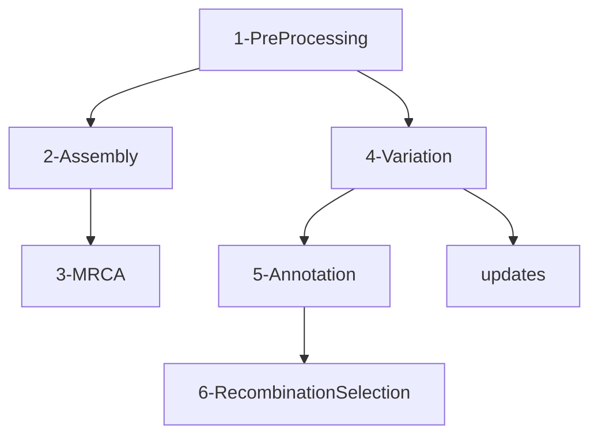
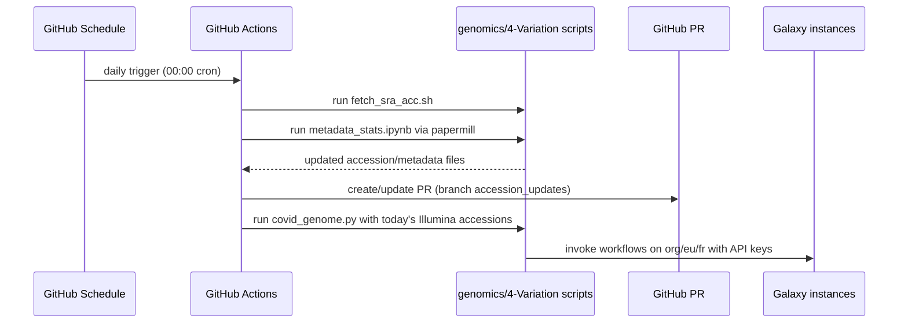
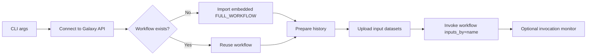

# Workflow and Operations

## 1) Cross-domain map

The repository is organized by analysis domain. Each domain usually includes:

- a domain landing page
- links to Galaxy workflow(s)
- links to shared Galaxy histories
- supporting diagrams and/or result artifacts

| Domain | Primary folder | Typical assets |
|---|---|---|
| Genomics | `genomics/` | multiple step-specific docs, deploy workflows, update scripts, result artifacts |
| Cheminformatics | `cheminformatics/` | docking/scoring workflow docs and deploy workflows |
| Proteomics | `proteomics/` | per-dataset reanalysis pages and workflow links |
| Direct RNAseq | `direct-rnaseq/` | preprocessing + epigenetics workflow docs |
| ARTIC | `artic/` | ARTIC protocol-specific workflow and required BED/amplicon files |
| Evolution | `evolution/` | Observable notebooks |
| Data | `data/`, `data-availability/` | mirrored data access and availability notebooks |

## 2) Genomics pipeline decomposition

Genomics is the deepest and most operationally active section.

Key workflow files (genomics deploy):

- `Genomics-1-PreProcessing_with_download.ga`
- `Genomics-1-PreProcessing_without_downloading_from_SRA.ga`
- `Genomics-2-Assembly.ga`
- `Genomics-3-MRCA.ga`
- `Genomics-4-Paired_End_Alignment.ga`
- `Genomics-4-Single_End_Alignment.ga`
- `Genomics-4-Variant_Calling_Lofreq.ga`
- `Genomics-4-all-in-one-subworkflow.ga`
- `Genomics-5-S-analysis.ga`
- `Genomics-6-RecombinationSelection.ga`

Note: both `Genomics-4-parallel-download.ga` and `Genomics-4-parallel-download.g` exist.

## 3) Scheduled update operation (variation)

A daily automation (`.github/workflows/fetch_accessions.yaml`) updates accessions and triggers variation workflows.

Operational behavior:

- accession metadata is refreshed from ENA-based query logic (`fetch_sra_acc.sh`)
- newly seen accessions are appended to `accession_and_date.tsv`
- summary notebook in `genomics/4-Variation/updates/` is executed
- action opens/updates a PR
- variation workflows are invoked remotely through `bioblend` in `covid_genome.py`

## 4) `covid_genome.py` execution model

`genomics/4-Variation/covid_genome.py` is a CLI wrapper that:

1. Connects to a Galaxy instance (`bioblend.galaxy.GalaxyInstance`)
2. Ensures workflow availability (imports embedded `FULL_WORKFLOW` if needed)
3. Creates or reuses a target history
4. Uploads required inputs:
   - accessions file
   - NC_045512.2 FASTA
5. Invokes workflow using input names
6. Optionally monitors invocation

## 5) Cheminformatics operation model

Cheminformatics is structured as a compound-screening pipeline:

- ligand enumeration
- active-site preparation
- docking
- scoring (SuCOS and TransFS)
- filtering/selection
- all-in-one combined workflow

It has explicit deployment support via:

- `cheminformatics/deploy/all_covid_tools.yaml`
- `cheminformatics/deploy/workflows/*.ga`
- deployment instructions in `cheminformatics/deploy/README.md`

## 6) Other domain workflow patterns

- **Proteomics**: Each subfolder (`PXD*` / `mPXD*`) represents a study-specific rerun with linked Galaxy resources.
- **Direct RNAseq**: Two-stage pattern (preprocessing + methylation analysis).
- **ARTIC**: Amplicon-aware workflow variants and specific required primer/amplicon metadata files.
- **Evolution/Data availability**: Observable notebook embeds as interactive external analyses.

## 7) Reproducibility strategy in this repository

Reproducibility is achieved by publishing, for each analysis area:

- exact workflow links
- shared Galaxy histories
- static companion docs and figures
- deployable workflow files for self-hosted Galaxy instances
